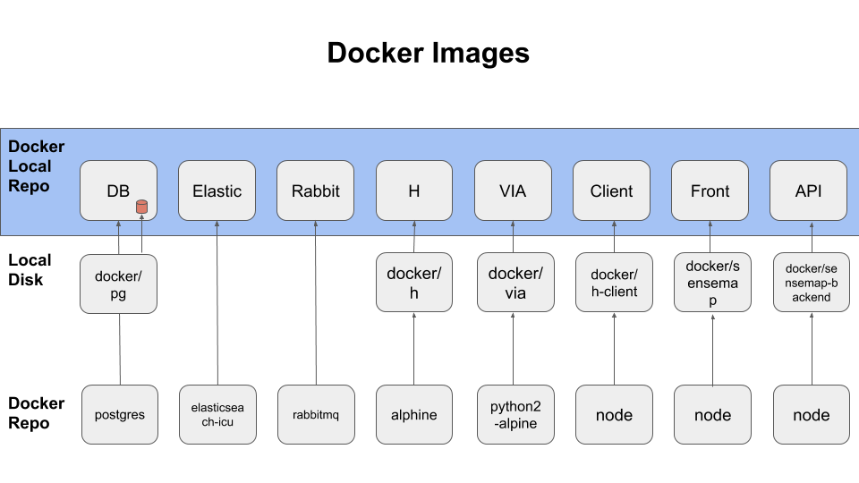
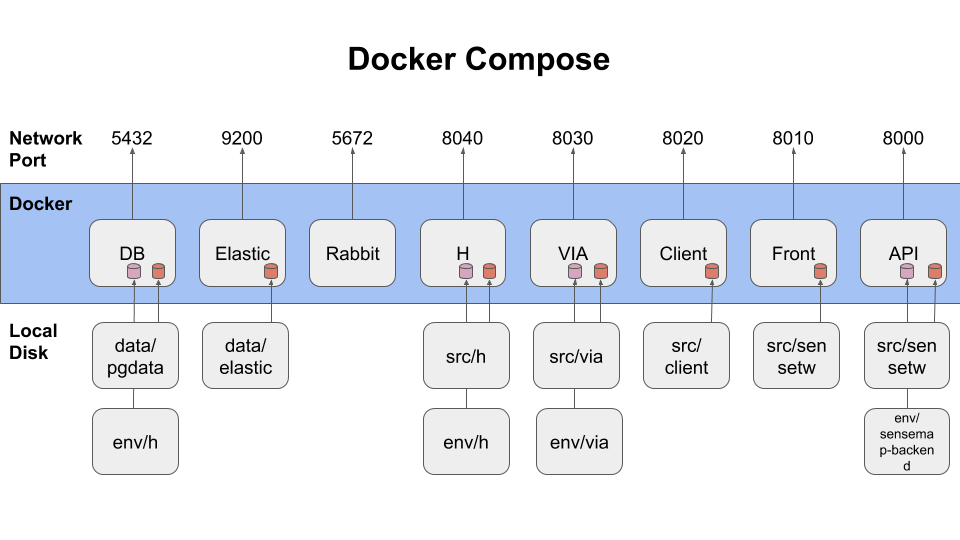

SenseTW 開發環境
===================

# 系統需求
* 專案僅在 Mac/Ubuntu 測試無誤 
* 系統上必須備有 Docker
* 系統上必須備有 Git
* VSCode 則是非必要, 但此專案備有 VSCode Debug 設定檔

# 安裝
```
git clone https://github.com/SenseTW/devenv.git
cd devenv
git submodule init
./install.sh
```

# 啟動
```
docker-compose up
```
接著靜待安裝, 及啟動. 可按下 Ctrl+C 停止運行, 但僅暫停 Container 運作.

# 移除
```
docker-compose down
```
該指令將會清除現有 Container

# 清除資料庫
```
rm -rf data
```

# Network Port
- PostgreSQL: localhost:5432
- elastic: localhost:9200,9300
- rabbit: localhost:5672,15672
- Sensemap-Backend: localhost:8000
- Sensemap: localhost:8010
- client: localhost:8020
- via: localhost:8030
- h: localhost:8040
  - admin/admin
  - test/test

# 基本設定
- h 預設管理員帳密為 admin/admin

# 環境架構
下圖為 Docker Images 架構

下圖為 Docker Compose 架構



# 使用方法
- src 所放置的程式碼皆以 submodule 的方式放進來, 請依照 submodule 的規則進行操作
- 在 src 更動 code 或是更換 branch 後, 靜待 code 重新編譯好
- 可以在 docker-compose 的視窗看到目前運作進度
- 在 VSCode 選擇 Debug -> Start Debugging 進行偵錯
- 環境變數位於 env/ 裡, 更動後重新啟動 docker-compose
- 資料庫放置在 data/pgdata 裡, 直接刪除後, 務必跑一次 ./install.sh 重建目錄, 在 pg 首次啟動後會自動進行初始化

# 更動啟動程序
- 所有啟動程序都放在 docker/ 底下, 至少會有 Dockerfile 以及 entrypoint.sh 兩個檔案
- Dockerfile 用以描述 container 內所需環境及套件
- entrypoint.sh 則為 container 啟動之後第一個執行的 script , 所有 app 啟動的方法都會描述在這裡
- 任何在 docker/ 底下的檔案被修改, 要使其生效, 必須執行 ./install.sh 
